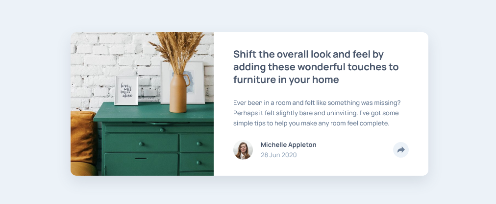

# Frontend Mentor - Article Preview Component Solution

This is a solution to the Article Preview Component challenge on Frontend Mentor. Frontend Mentor challenges help you improve your coding skills by building realistic projects.

## Table of contents

- [Overview](#overview)
  - [The challenge](#the-challenge)
  - [Screenshot](#screenshot)
  - [Links](#links)
- [My process](#my-process)
  - [Built with](#built-with)
  - [What I learned](#what-i-learned)
- [Author](#author)

## Overview

### The challenge

Users should be able to:

- View the optimal layout for the component depending on their device's screen size
- See hover and focus states for all interactive elements on the page
- Toggle the share menu open and closed seamlessly on both mobile and desktop views

### Screenshot



### Links

- [Solution](https://github.com/Kking927/article-preview-component)
- [Live Site](https://kking927.github.io/article-preview-component/)

## My process

### Built with

- Semantic HTML5
- CSS Custom Properties and BEM naming convention
- Flexbox layouts with a mobile-first workflow
- Vanilla JavaScript

### What I learned

During this project, I gained more practice building responsive layouts, positioning floating popovers, and managing interactive UI states across different screen sizes.

One of the biggest challenges was handling the layout transition for the share menu between mobile and desktop views. On mobile, the share menu acts as a full-width overlay at the bottom of the card, while on desktop, it transforms into a floating tooltip popover centered above the share button.

Resetting the mobile `inset` values using `inset: auto` on desktop made positioning the tooltip straightforward:

```css
/* Mobile full-bleed overlay */
.card__share-menu {
  display: none;
  position: absolute;
  inset: -1.25rem -2rem -1.5rem -2rem;
  background-color: var(--clr-primary);
  border-radius: 0 0 var(--radius-md) var(--radius-md);
}

/* Desktop floating popover */
@media (min-width: 48rem) {
  .card__share-menu {
    inset: auto;
    bottom: 3.5rem;
    right: -6.75rem;
    border-radius: var(--radius-md);
  }
}
```

I also practiced toggling dynamic state classes with JavaScript to keep the button styling, author visibility, and share menu visibility synchronized:

```
const shareBtn = document.querySelector(".card__share-btn");
const shareMenu = document.querySelector(".card__share-menu");
const cardFooter = document.querySelector(".card__footer");

shareBtn.addEventListener("click", () => {
  shareBtn.classList.toggle("active");
  shareMenu.classList.toggle("active");
  cardFooter.classList.toggle("share-active");
});
```

 ## Author


- Frontend Mentor - [@Kking927](https://www.frontendmentor.io/profile/Kking927) 
